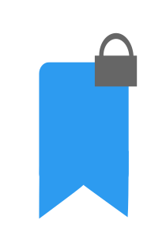

# TabLock 
### ***Save*** tabs with ***security***
<pre>
1. Introduction
</pre>

TabLock is a Chrome extension that allows you to save your sensitive tabs and websites securely. TabLock improves on Chrome's built-in bookmark feature by adding password protection and an intuitive UI so the user can feel safe saving their tabs and easily navigate their saved tabs and windows.

<pre>
2. Usage
</pre>
- Saving tabs
    - Use the "save tab" button to save the current tab 
    - Use the "save window" button to save all tabs in the current Chrome window as a group
    - Enter a name (up to 10 characters) and a password to lock the tab/window
- Restoring tabs or deleting instances
    - Navigate to the tab/window you want to access
    - Click the button and enter you password for that tab/window to open the tab(s)
    - Click the "x" on the right side of the button to delete that instance 

<pre>
3. Features
</pre>
- Password protection
    - Users can enter a password to secure their tabs that may hold sensitive information
- Browser security features
    - URLs are saved and secured using the [CryptoJS][1] library within the browser to ensure that users maintain a sense of privacy
- Intuitive UI
    - The UI offers an easy user experience that allows a greater sense of security when saving tabs long term
    - The layout defines a clear-cut separation between tabs saved in a group or by itself

[1]: https://www.npmjs.com/package/crypto-js
